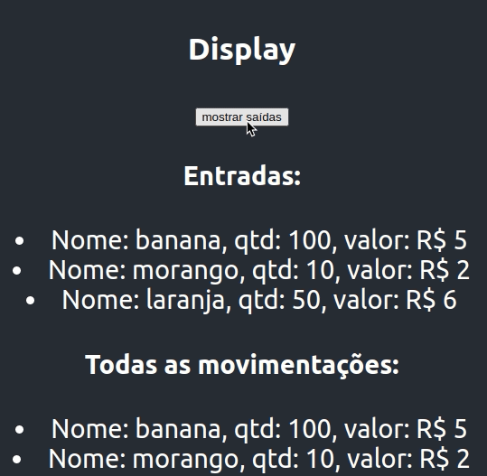

# Quitanda de frutas

## Pré Requisitos

-   A aplicação deverá apresentar 4 componentes
-   Resolver utilizando métodos de array (map, filter, reduce, etc)
-   Utilizar **Conditional Render** para mostrar entradas e saidas das frutas em estoque

## Sobre a aplicação

-   O usuário pode:

    -   Cadastrar uma entrada de novas frutas
    -   Cadastrar uma saida de frutas no estoque

-   A aplicaçao deve conter:

    -   Um display para mostrar somente as entradas ou saidas
    -   Um formulario para cadastrar entradas ou saidas de frutas
    -   Um display para mostrar todas as movimentações feitas
    -   A quantidade total de frutas vendidas
    -   A quantidade total de entrada de frutas
    -   O valor total de saídas

### Observação

-   No input de quantidades:

    -   **Valores negativos** são referentes as **saídas**;
    -   **Valores positivos** são referentes as **entradas**.

### Utilize como base este array de frutas

```
[
    { name: "banana", quantity: 100, price: 5 },
    { name: "morango", quantity: 10, price: 2 },
    { name: "laranja", quantity: 50, price: 6 },
]
```

---

## Veja no gif de exemplo o display para mostrar entradas e saídas


